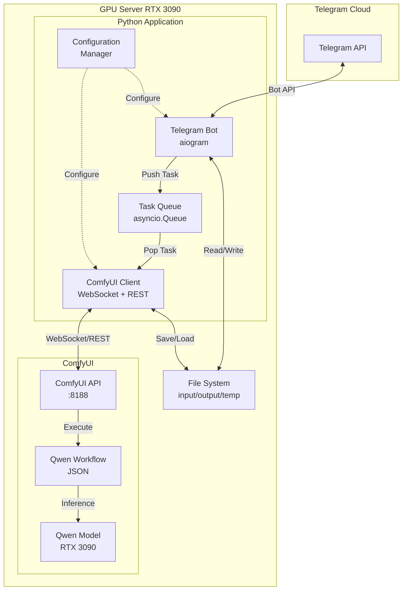
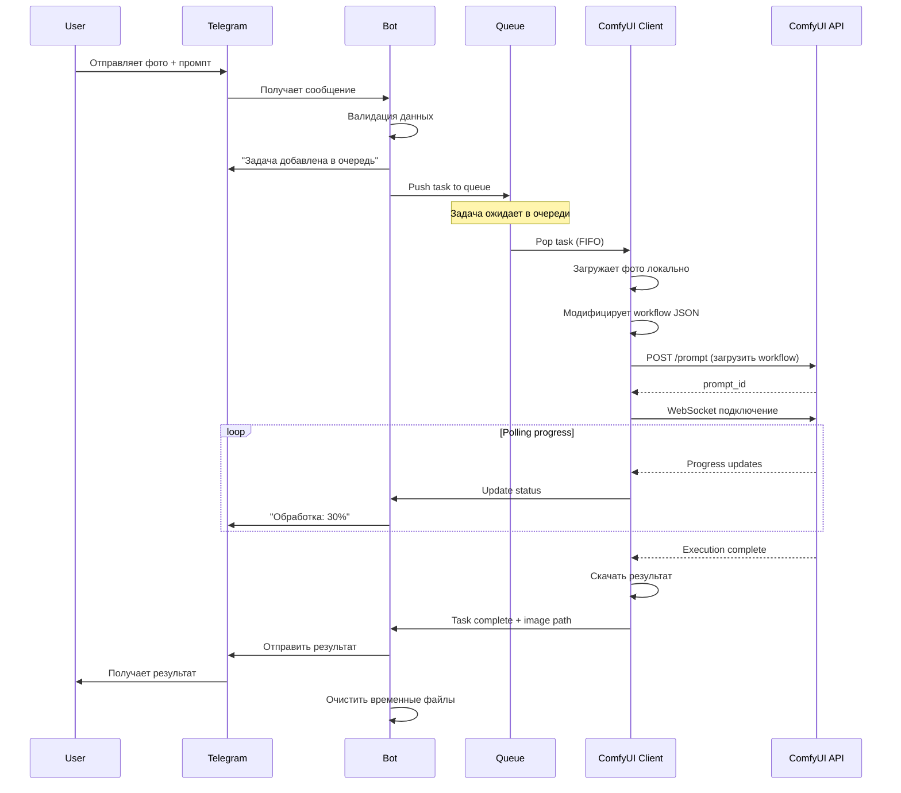

# 🏗️ Архитектура Qwen Image Edit Bot

## 📋 Обзор проекта

**Цель**: Создать Telegram бота для редактирования изображений с использованием Qwen Image Edit модели через ComfyUI API.

**Окружение**: 
- Сервер: Ubuntu/Debian с RTX 3090 24GB + 96GB RAM
- ComfyUI и бот на одном сервере (локальное взаимодействие)
- Деплой: Git + systemd сервисы

---

## 🎯 Ключевые требования

### Функциональные требования
- ✅ Прием изображения + текстовый промпт от пользователя
- ✅ Обработка через ComfyUI Qwen Image Edit workflow
- ✅ Полный контроль параметров: `steps`, `seed`, `cfg`, `sampler`, `scheduler`, `strength`
- ✅ Последовательная обработка задач (FIFO очередь)
- ✅ Отправка результата обратно в Telegram

### Нефункциональные требования
- ✅ Минимум зависимостей
- ✅ Простота поддержки и модификации
- ✅ Надежность и отказоустойчивость
- ✅ Логирование и мониторинг
- ✅ Возможность горячего обновления workflow параметров

---

## 🏛️ Архитектура системы

### Компоненты высокого уровня



### Описание компонентов

#### 1. **Telegram Bot** (`aiogram`)
- Прием сообщений от пользователей
- Валидация входных данных
- Управление пользовательскими сессиями
- Отправка промежуточных статусов
- Обработка команд и inline-кнопок

#### 2. **Task Queue** (`asyncio.Queue`)
- FIFO очередь задач
- Thread-safe операции
- Поддержка async/await
- Мониторинг размера очереди

#### 3. **ComfyUI Client**
- REST API для загрузки изображений
- WebSocket для отслеживания прогресса
- Динамическая модификация workflow JSON
- Получение результатов

#### 4. **Configuration Manager**
- Загрузка настроек из `.env` и `config.yaml`
- Валидация конфигурации
- Значения по умолчанию для параметров
- Hot-reload конфигурации

#### 5. **File System Manager**
- Управление временными файлами
- Очистка старых файлов
- Хранение результатов

---

## 📁 Структура проекта

```
image-edit-bot/
├── .env                          # Секретные данные (не в Git)
├── .env.example                  # Пример конфигурации
├── .gitignore
├── README.md
├── requirements.txt              # Python зависимости
├── config.yaml                   # Основная конфигурация
│
├── workflows/                    # ComfyUI workflow файлы
│   └── qwen_image_edit.json     # Базовый workflow
│
├── systemd/                      # Systemd сервисы
│   ├── comfyui.service
│   └── telegram-bot.service
│
├── scripts/                      # Утилиты и скрипты
│   ├── install.sh               # Установка зависимостей
│   ├── setup_services.sh        # Настройка systemd
│   └── test_comfyui.py          # Тест ComfyUI API
│
├── src/                          # Исходный код
│   ├── __init__.py
│   │
│   ├── main.py                  # Точка входа
│   │
│   ├── bot/                     # Telegram бот
│   │   ├── __init__.py
│   │   ├── handlers.py          # Обработчики команд
│   │   ├── keyboards.py         # Inline клавиатуры
│   │   ├── states.py            # FSM состояния
│   │   └── filters.py           # Пользовательские фильтры
│   │
│   ├── comfyui/                 # ComfyUI интеграция
│   │   ├── __init__.py
│   │   ├── client.py            # API клиент
│   │   ├── workflow.py          # Управление workflow
│   │   └── websocket.py         # WebSocket обработчик
│   │
│   ├── queue/                   # Система очередей
│   │   ├── __init__.py
│   │   ├── task_queue.py        # Очередь задач
│   │   └── processor.py         # Обработчик задач
│   │
│   ├── models/                  # Модели данных
│   │   ├── __init__.py
│   │   ├── task.py              # Task dataclass
│   │   └── config.py            # Config dataclass
│   │
│   ├── storage/                 # Файловое хранилище
│   │   ├── __init__.py
│   │   └── file_manager.py      # Управление файлами
│   │
│   └── utils/                   # Утилиты
│       ├── __init__.py
│       ├── config_loader.py     # Загрузка конфигурации
│       ├── logger.py            # Настройка логирования
│       └── validators.py        # Валидация данных
│
├── data/                        # Рабочие данные
│   ├── input/                   # Входные изображения
│   ├── output/                  # Результаты
│   └── temp/                    # Временные файлы
│
├── logs/                        # Логи
│   ├── bot.log
│   └── comfyui.log
│
└── tests/                       # Тесты
    ├── __init__.py
    ├── test_client.py
    ├── test_queue.py
    └── test_workflow.py
```

---

## 🔧 Технологический стек

### Core Dependencies

```python
# Telegram Bot
aiogram==3.x                    # Современный async Telegram bot framework
aiohttp==3.x                    # Async HTTP client/server

# ComfyUI Integration
websockets==12.x               # WebSocket client
Pillow==10.x                   # Image processing

# Configuration
python-dotenv==1.x             # .env файлы
PyYAML==6.x                    # YAML конфигурация
pydantic==2.x                  # Валидация данных

# Utilities
loguru==0.7.x                  # Продвинутое логирование
```

### Обоснование выбора

**Почему `aiogram`?**
- ✅ Полностью async (идеально для I/O операций)
- ✅ Современный API (Telegram Bot API 7.0+)
- ✅ Встроенная FSM (Finite State Machine)
- ✅ Отличная документация и активное сообщество
- ✅ Middleware и фильтры из коробки

**Почему `asyncio.Queue`?**
- ✅ Встроенная в Python (нет внешних зависимостей)
- ✅ Thread-safe и coroutine-safe
- ✅ Простая интеграция с async/await
- ✅ Подходит для простой FIFO очереди

**Альтернативы (if needed later):**
- Redis Queue (для распределенной системы)
- Celery (для сложных задач)

---

## 🔄 Workflow обработки задачи



---

## 🎛️ Система конфигурации

### `.env` (секретные данные)

```bash
# Telegram Bot
TELEGRAM_BOT_TOKEN=your_bot_token_here
ADMIN_USER_IDS=123456789,987654321

# ComfyUI
COMFYUI_HOST=127.0.0.1
COMFYUI_PORT=8188

# Paths
DATA_DIR=/app/data
LOGS_DIR=/app/logs
```

### `config.yaml` (параметры workflow)

```yaml
# Workflow настройки
workflow:
  default_file: "workflows/qwen_image_edit.json"
  
  # Значения по умолчанию
  defaults:
    steps: 8
    cfg: 1.0
    sampler: "linear/euler"
    scheduler: "simple"
    seed: 0  # 0 = random
    strength: 0.5
    eta: 0.5
    denoise: 1.0
  
  # Лимиты
  limits:
    min_steps: 1
    max_steps: 50
    min_cfg: 0.1
    max_cfg: 20.0
    min_strength: 0.0
    max_strength: 1.0

# Image настройки
image:
  max_size_mb: 10
  allowed_formats: ["jpg", "jpeg", "png", "webp"]
  scale_megapixels: 1.0  # ImageScaleToTotalPixels

# Queue настройки
queue:
  max_size: 100
  timeout_seconds: 300

# Storage настройки
storage:
  cleanup_after_hours: 24
  keep_results: true

# Logging
logging:
  level: "INFO"
  rotation: "100 MB"
  retention: "7 days"
```

---

## 🔌 ComfyUI API Integration

### Анализ workflow

Из вашего [`Qwen Image Edit Rapid.json`](Qwen Image Edit Rapid.json):

**Ключевые узлы:**
1. **Node 118**: `CheckpointLoaderSimple` - загрузка модели
2. **Node 78**: `LoadImage` - входное изображение
3. **Node 119**: `TextEncodeQwenImageEditPlus` - positive prompt
4. **Node 77**: `TextEncodeQwenImageEdit` - negative prompt
5. **Node 121**: `ClownsharKSampler_Beta` - sampling
6. **Node 8**: `VAEDecode` - декодирование
7. **Node 102**: `Image Saver Simple` - сохранение

**Параметры для замены:**

```python
# Пример модификации workflow
workflow_template = {
    "118": {  # Checkpoint
        "inputs": {
            "ckpt_name": "Qwen-Rapid-AIO-NSFW-v11.4.safetensors"
        }
    },
    "78": {  # Input Image
        "inputs": {
            "image": "temp_input_12345.png"  # Динамически
        }
    },
    "119": {  # Positive Prompt
        "inputs": {
            "prompt": user_prompt  # От пользователя
        }
    },
    "77": {  # Negative Prompt
        "inputs": {
            "prompt": negative_prompt  # От пользователя
        }
    },
    "117": {  # Seed
        "inputs": {
            "value": seed  # Параметр
        }
    },
    "115": {  # Steps
        "inputs": {
            "value": steps  # Параметр
        }
    },
    "121": {  # Sampler
        "inputs": {
            "sampler_name": sampler,
            "scheduler": scheduler,
            "cfg": cfg,
            "eta": eta,
            "denoise": denoise
        }
    }
}
```

### REST API методы

```python
# 1. Загрузка изображения
POST http://127.0.0.1:8188/upload/image
Content-Type: multipart/form-data

# 2. Постановка задачи в очередь
POST http://127.0.0.1:8188/prompt
Body: {"prompt": workflow_json}

# 3. Получение истории
GET http://127.0.0.1:8188/history/{prompt_id}

# 4. WebSocket для прогресса
WS ws://127.0.0.1:8188/ws?clientId={client_id}
```

---

## 🤖 Telegram Bot UI/UX

### Команды

```
/start - Начать работу с ботом
/help - Помощь и примеры
/new - Создать новую задачу
/status - Статус очереди
/settings - Настройки параметров
/cancel - Отменить текущую задачу
```

### Сценарий использования

**1. Простой режим (Quick Mode):**
```
User: /new
Bot: Отправьте изображение для редактирования
User: [фото]
Bot: Отправьте промпт (описание изменений)
User: "remove background, make professional portrait"
Bot: ⏳ Задача в очереди (позиция: 1)
     Начало обработки...
     Прогресс: [████░░░░] 50%
     ✅ Готово!
     [результат]
```

**2. Продвинутый режим (Advanced Mode):**
```
User: /settings
Bot: [Inline Keyboard]
     ⚙️ Steps: 8  [⊖][⊕]
     🎲 Seed: random  [🔢 Set]
     🎛️ CFG: 1.0  [⊖][⊕]
     🔄 Sampler: euler  [Change]
     ✅ Применить
     
User: [настраивает параметры]
User: /new [фото + промпт]
Bot: [обработка с кастомными параметрами]
```

### Inline клавиатуры

```python
# Buttons для настроек
InlineKeyboardMarkup([
    [
        InlineKeyboardButton("⊖ Steps", callback_data="steps_down"),
        InlineKeyboardButton("8", callback_data="steps_current"),
        InlineKeyboardButton("Steps ⊕", callback_data="steps_up")
    ],
    [
        InlineKeyboardButton("🎲 Random Seed", callback_data="seed_random"),
        InlineKeyboardButton("🔢 Set Seed", callback_data="seed_set")
    ],
    # ... другие параметры
    [InlineKeyboardButton("✅ Сохранить", callback_data="settings_save")]
])
```

---

## 🛡️ Обработка ошибок

### Типы ошибок

```python
class BotError(Exception):
    """Базовый класс для ошибок бота"""

class ComfyUIConnectionError(BotError):
    """ComfyUI недоступен"""

class WorkflowExecutionError(BotError):
    """Ошибка выполнения workflow"""

class InvalidParametersError(BotError):
    """Некорректные параметры"""

class QueueFullError(BotError):
    """Очередь переполнена"""
```

### Стратегии обработки

```python
# 1. Retry с exponential backoff
@retry(
    stop=stop_after_attempt(3),
    wait=wait_exponential(multiplier=1, min=4, max=10)
)
async def connect_to_comfyui():
    ...

# 2. Graceful degradation
if not comfyui_available:
    await bot.send_message(
        user_id,
        "⚠️ Сервер временно недоступен. Попробуйте позже."
    )

# 3. Уведомление администратора
if critical_error:
    await notify_admin(error_details)
```

---

## 📊 Логирование и мониторинг

### Структура логов

```python
from loguru import logger

# Конфигурация
logger.add(
    "logs/bot.log",
    rotation="100 MB",
    retention="7 days",
    level="INFO",
    format="{time:YYYY-MM-DD HH:mm:ss} | {level} | {module}:{function}:{line} | {message}"
)

# Примеры логов
logger.info("Task {task_id} added to queue", task_id=task.id)
logger.debug("Workflow modified: {params}", params=workflow_params)
logger.warning("Queue size: {size}/{max}", size=queue.qsize(), max=MAX_QUEUE_SIZE)
logger.error("ComfyUI connection failed: {error}", error=str(e))
logger.critical("Critical error, notifying admin")
```

### Метрики

```python
# Простой мониторинг
metrics = {
    "tasks_total": 0,
    "tasks_success": 0,
    "tasks_failed": 0,
    "queue_current_size": 0,
    "avg_processing_time": 0.0
}

# Сохранение в JSON для внешнего мониторинга
with open("metrics.json", "w") as f:
    json.dump(metrics, f)
```

---

## 🚀 Деплой и установка

### systemd сервисы

**`/etc/systemd/system/comfyui.service`:**
```ini
[Unit]
Description=ComfyUI Image Generation Service
After=network.target

[Service]
Type=simple
User=comfyui
WorkingDirectory=/opt/ComfyUI
ExecStart=/opt/ComfyUI/venv/bin/python main.py --listen 127.0.0.1 --port 8188
Restart=always
RestartSec=10
StandardOutput=append:/var/log/comfyui/output.log
StandardError=append:/var/log/comfyui/error.log

Environment="CUDA_VISIBLE_DEVICES=0"

[Install]
WantedBy=multi-user.target
```

**`/etc/systemd/system/telegram-bot.service`:**
```ini
[Unit]
Description=Telegram Image Edit Bot
After=network.target comfyui.service
Requires=comfyui.service

[Service]
Type=simple
User=botuser
WorkingDirectory=/opt/image-edit-bot
ExecStart=/opt/image-edit-bot/venv/bin/python src/main.py
Restart=always
RestartSec=10
StandardOutput=append:/var/log/telegram-bot/output.log
StandardError=append:/var/log/telegram-bot/error.log

EnvironmentFile=/opt/image-edit-bot/.env

[Install]
WantedBy=multi-user.target
```

### Скрипт установки

```bash
#!/bin/bash
# scripts/install.sh

set -e

echo "🚀 Installing Image Edit Bot..."

# 1. Создание виртуального окружения
python3 -m venv venv
source venv/bin/activate

# 2. Установка зависимостей
pip install --upgrade pip
pip install -r requirements.txt

# 3. Создание необходимых директорий
mkdir -p data/{input,output,temp}
mkdir -p logs

# 4. Копирование примера конфигурации
if [ ! -f .env ]; then
    cp .env.example .env
    echo "⚠️  Отредактируйте .env файл с вашими данными"
fi

# 5. Установка прав
chmod +x scripts/*.sh

echo "✅ Installation complete!"
echo "Next steps:"
echo "1. Edit .env file"
echo "2. Configure config.yaml"
echo "3. Run: ./scripts/setup_services.sh"
```

---

## 🔄 Процесс разработки и тестирования

### Git workflow

```bash
# 1. Разработка локально
git checkout -b feature/telegram-handlers
# ... coding ...
git commit -m "feat: add telegram message handlers"
git push origin feature/telegram-handlers

# 2. Деплой на сервер
ssh user@server
cd /opt/image-edit-bot
git pull origin main
sudo systemctl restart telegram-bot

# 3. Проверка логов
journalctl -u telegram-bot -f
```

### Тестирование

```bash
# 1. Локальное тестирование ComfyUI API
python scripts/test_comfyui.py

# 2. Unit тесты
pytest tests/ -v

# 3. Интеграционный тест
python -m src.main --test-mode
```

---

## 📈 Масштабирование (опционально, на будущее)

Если понадобится обработка большой нагрузки:

1. **Redis Queue** вместо `asyncio.Queue`
2. **Multiple Workers** для параллельной обработки
3. **Load Balancer** для нескольких ComfyUI инстансов
4. **S3/MinIO** для хранения результатов
5. **PostgreSQL** для истории задач
6. **Prometheus + Grafana** для мониторинга

---

## 🔐 Безопасность

### Рекомендации

1. **Rate Limiting**: Ограничение запросов от пользователей
2. **Whitelist**: Доступ только для разрешенных пользователей
3. **Input Validation**: Проверка всех входных данных
4. **Firewall**: ComfyUI доступен только локально (127.0.0.1)
5. **Secrets**: Использование `.env` файла (не в Git)
6. **Updates**: Регулярные обновления зависимостей

---

## 📝 Чеклист перед запуском

### На локальной машине

- [ ] Создан и протестирован workflow в ComfyUI
- [ ] Workflow экспортирован в JSON
- [ ] Код написан и протестирован
- [ ] Unit тесты пройдены
- [ ] `.env.example` обновлен

### На сервере

- [ ] ComfyUI установлен и работает
- [ ] Модели загружены (checkpoint, VAE, text encoders)
- [ ] Python 3.10+ установлен
- [ ] Виртуальное окружение создано
- [ ] Зависимости установлены
- [ ] `.env` настроен с реальным токеном
- [ ] Systemd сервисы созданы
- [ ] Firewall настроен
- [ ] Логи доступны
- [ ] Тестовый запуск успешен

---

## 🎓 Дополнительные материалы

### Документация

- [aiogram Documentation](https://docs.aiogram.dev/)
- [ComfyUI API Examples](https://github.com/comfyanonymous/ComfyUI/wiki/API)
- [Qwen Image Edit Model](https://huggingface.co/Phr00t/Qwen-Image-Edit-Rapid-AIO)

### Примеры кода

Будут добавлены в следующих файлах:
- `src/comfyui/client.py` - ComfyUI API client
- `src/bot/handlers.py` - Telegram handlers
- `src/queue/task_queue.py` - Queue manager

---

**Создано**: 2026-02-08  
**Версия**: 1.0  
**Статус**: 📋 Готово к review и реализации
